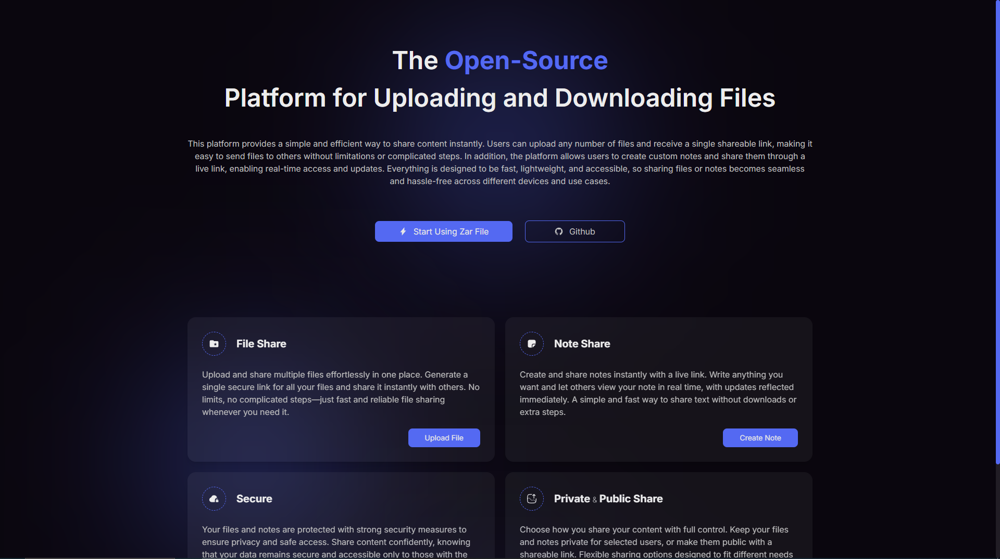

# Zar File

Open-Source Platform for Uploading and Downloading Files

Simple and optimized Personal Website [( See Demo )](https://file.amabazari.ir/) . It includes:

- [x] Next.js 16.1.5
- [x] Archiver 7.0.1
- [x] react-md-editor 4.0.11
- [x] Eslint linting with continuous linting on file change
- [x] Prettier
- [x] knip
- [x] tailwindcss 4
- [x] react-compiler 1

## Starting the dev server

Make sure you have the latest Stable or LTS version of Node.js installed.

1. `git clone https://github.com/am-abazari/zar-file.git`
2. Run `npm install` or `yarn install`
3. Start the dev server using `npm run dev` or `yarn dev`
4. Open [http://localhost:3000/](http://localhost:3000/)

## Environment Variables

1. Create `.env` file inside of project
2. Set `API_BASE_URL` value to your backend api.
3. set `UPLOAD_DIR` value. (default is `uploads/private`)
4. set `NOTES_DIR` value. (default is `notes`)
5. set `NEXT_PUBLIC_API_URL` value. (default is `api`)
6. set `NEXT_PUBLIC_API_VERSION` value. (default is `v1`)

## Available Commands

- `npm run dev` - start the dev server
- `npm run build` - building project
- `npm run start` - start build files
- `npx knip` - find unused files or exports
- `npx prettier . --write` format all files and write them
- `npm run lint` linting files

## Code Coverage

The project is using the <strong>Next.js</strong>. All configurations are located in `package.json`

You can find Alias and url configs in `tsconfig.json`

Vercel deployment configs located in `vercel.json`

Configs about redirecting pages are located in `next.config.json`

You can config `prttier` and `eslint` in `.prettierrc.json` and `eslint.config.mjs` or `.eslintrc.json` files

## About Author

<strong>[Amirhossein Abazari](https://amabazari.ir)</strong> Full-Stack Web Developer
